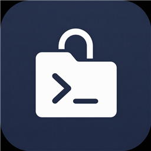

<div align="center">



# dsh-ssh-workspace

**Use a directory on an SSH host as a DSH workspace.**

`read` / `write` / `edit` go straight over SFTP to read and write remote files —
no manual sync, no mount driver, no third-party filesystem.

[](https://github.com/siqyka/dsh-ssh-workspace)
[](./LICENSE)


[简体中文](./README.md) · **English**

</div>

---

<table>
<tr>
<td align="center" width="33%">

**Direct SFTP**

Reads, writes and edits run over SFTP
with full error semantics and atomic writes

</td>
<td align="center" width="33%">

**Remote execution**

Shell, ripgrep and git
all run on the remote host

</td>
<td align="center" width="33%">

**UI integration**

File tree, `@` references, drag-to-task
and a host management panel out of the box

</td>
</tr>
</table>

## Contents

- [Overview](#overview)
- [Quick start](#quick-start)
- [Host management](#host-management)
- [Configuration](#configuration)
- [Agent tools](#agent-tools)
- [Capabilities](#capabilities)
- [Limitations](#limitations)
- [Implementation notes](#implementation-notes)
- [Documentation index](#documentation-index)
- [License](#license)

## Overview

Workspace path syntax:

```
ssh://<alias>/<remote-absolute-path>
e.g.   ssh://myserver/home/user/project
```

In the UI these paths are **displayed** as `ssh://<alias>@/<remote-absolute-path>`
(an `@` is inserted after the alias, so it reads like an SSH address) — that is how
they appear on sidebar workspace-row hover cards, the right sidebar's "Files" panel
header, document-preview headers, and elsewhere. Copying and every functional use
(mounting, file operations, tool calls) still use the real spelling
`ssh://<alias>/<remote-absolute-path>`.

### The problem it solves

DSH routes all file operations through a single service abstraction, `ctx.fs`
(`@deepseek-ai/dsh-fs`). This plugin adds a "remote half" to that abstraction:

```
        DSH tool layer (read / write / edit / bash / glob / grep / Changes panel)
                                   │
                              ctx.fs router
                                   │
            ┌──────────────────────┴──────────────────────┐
            │                                             │
   ssh://<alias>/<path>                    everything else (E:\…, /home/…)
            │                                             │
   This plugin's SFTP backend ──► SSH host   The deployment's original local
                                            (sandbox) backend
```

So **everything about local workspaces stays as it was**, including the sandbox write
fence, version guards, and atomic writes; remote workspaces get the same tools and the
same error semantics.

## Quick start

1. **Install**: open the official desktop client and go to the **Plugins** page under
   **Settings** (or the plugins entry in the left navigation bar);
2. **Enter the address**: in the plugin manager's install field, enter this repository's
   address `https://github.com/siqyka/dsh-ssh-workspace` and click Install;
3. **Restart**: restart the client once installation finishes, and you're ready to go.

From there:

```
Confirm your hosts in the "Remote Workspaces" panel (add one if needed)
        │
        ▼
"Add workspace → New remote workspace": pick a host, browse the remote directory, mount
        │
        ▼
Create a session in that workspace — file I/O, shell, search and change tracking
all land on the remote host automatically
```

## Host management

Host records live in `$DSH_HOME/dsh-ssh.json`; when that file is absent, the plugin
falls back to concrete `Host` blocks in `~/.ssh/config`. So **hosts you have already
configured need no re-entry**.

The "Remote Workspaces" panel can **add / edit / delete** hosts directly, writing back
to `$DSH_HOME/dsh-ssh.json` (atomic writes; fields the plugin doesn't recognize are
preserved). Hosts from `~/.ssh/config` are a **read-only fallback** — the panel never
modifies that file; when the same name exists in both, the store wins. Passwords / key
passphrases are stored **in plaintext** per that store format and are never sent back
to the browser; leaving them blank while editing keeps the current value. Deleting a
host does not automatically unmount its mounted workspaces, but those workspaces
become inaccessible since the host no longer exists.

> See [docs/hosts.md](./docs/hosts.md) for the storage format, `~/.ssh/config` parsing
> rules, and the credential policy.

## Configuration

| Field | Default | Meaning |
| --- | --- | --- |
| `enabled` | `true` | Master switch |
| `announceToAgent` | `false` | Whether to inject a capability description (a system-prompt section) into every agent |
| `engine.idleTimeoutMs` | `1800000` | Recycle a connection after it stays idle this long (ms) |
| `engine.connectTimeoutMs` | `15000` | Per-connect SSH handshake budget (ms) |
| `engine.keepaliveIntervalMs` | `15000` | Keepalive heartbeat interval (ms) |
| `engine.sweepIntervalMs` | `60000` | How often idle connections are swept (ms) |

> All four `engine` entries are optional (invalid values fall back to the defaults) and rarely need tuning.

## Agent tools

| Tool | Purpose |
| --- | --- |
| `ssh_workspace_hosts` | List available hosts (store + `~/.ssh/config` candidates) |
| `ssh_workspace_mount` | Register a remote directory as a workspace and return an `ssh://` path |
| `ssh_workspace_unmount` | Unregister a remote workspace |
| `ssh_workspace_status` | Current mount points and connection state |
| `ssh_workspace_exec` | Run a shell command **on the remote host** |

> For tool parameters, return fields, and error semantics, see [docs/tools.md](./docs/tools.md).

## Capabilities

### Remote files

| Capability | Details |
| --- | --- |
| Full error semantics | `read` / `write` / `edit` run entirely over SFTP, with `FS_STALE_VERSION`, `FS_NOT_OBSERVED`, `FS_AMBIGUOUS_EDIT`, `FS_NOT_TEXT`, `FS_TOO_LARGE`, `FS_NOT_FOUND`, and so on |
| Atomic writes | A write first lands in a staging file in the same directory, then replaces the target. OpenSSH's `posix-rename@openssh.com` is preferred; when the server doesn't support it, the plugin degrades to "delete, then rename" (no longer atomic in that case) |
| Line-ending fidelity | Editing a CRLF file won't rewrite it to LF |
| Binary and encoding | Text reads reject NUL / invalid UTF-8; `readBytes` returns raw bytes |
| Write fence | Remote writes may only land inside a mounted remote workspace; anything outside returns `FS_SANDBOX_DENIED`. Reads are unrestricted |
| Large files stream | Previews and `read` stream remote files in 256 KiB chunks instead of loading the whole file into memory |
| Remote changes auto-refresh | The sidebar file tree and previews pick up remote changes by polling — about every 2 seconds, backing off while idle (after 15 quiet rounds to 5 s, after 30 to 10 s) and snapping back to 2 s on any change. SFTP metadata has no sub-second timestamps, so consecutive rewrites of equal size within the same second may not trigger a refresh; additions, removals, and renames always do |

### Remote execution

| Capability | Details |
| --- | --- |
| Shell commands follow the workspace | With an `ssh://` session workspace, the `pwsh` / `bash` tools run on the remote host under POSIX shell semantics — one-shot commands, background jobs, timeouts, and cancellation all work through DSH's process contract; local `workdir` commands are unaffected |
| glob / grep search the remote | They invoke **ripgrep (`rg`) on the remote host** and return real remote results; when ripgrep isn't installed there, the command fails clearly with an install hint (exit code 127) |
| Change tracking goes remote | The "Changes" (deliverables) panel uses **remote git** for per-turn snapshots and diffs — files changed by remote shell commands show up too (+N/−N, click through to the diff); when git isn't installed remotely this capability quietly turns itself off and nothing else is affected |

### UI integration

| Capability | Details |
| --- | --- |
| New sessions work | The host's own `node:fs/promises` calls (the session controller's `mkdir`, the workspace registry's `realpath` / `stat`) also route `ssh://` paths over SFTP, and `node:path.isAbsolute` treats `ssh://` spellings as absolute — so you can create a session directly in a remote workspace |
| Automatic remount after restart | Registered `ssh://` workspaces are remounted from the persisted registry on next launch |
| The "Workspace Files" sidebar works | The file tree lists the remote directory directly and text previews are read over SFTP; `fs.fileUrl` returns the canonical `file:` URI of the **remote execution world** per the `dsh-fs` contract |
| `@` file references work remotely | The chat input's `@` completion draws candidates from the **remote** tree (recursive index + fuzzy ranking; queries containing `/` browse level by level; directory symlinks are never followed). A selection inserts `@relative/path`, and the model's `read` opens exactly that remote file |
| Drag or right-click a file onto the task | Files and folders in the tree can be **dragged straight onto the chat input** (dashed highlight while hovering; releasing inserts the reference chip) or picked via **right-click → "Add to task"** — both produce exactly what an `@` completion selection would |
| "Add workspace" gets a remote entry | DSH's "Add workspace" button becomes an anchored menu offering "New local workspace" (DSH's native picker) or "New remote workspace" (choose a host → browse the remote directory level by level → confirm the mount; unwritable directories produce a warning and refuse creation) |
| Remote workspaces wear a dedicated mark | Workspaces created by this plugin show the plugin's remote mark instead of the plain folder icon in sidebar rows, the workspace picker, and the session page's workspace button |
| Host management panel | Add / edit / delete hosts (key paths, auth method, notes, …); changes take effect immediately and drop that alias's old connection. `~/.ssh/config` hosts are shown read-only. "Test connection" results appear as a toast at the top that auto-dismisses after a few seconds (click to close early) |

### Connection model

One long-lived connection per alias — one always-open SFTP channel, with shell
commands opening exec channels on the same connection; recycled after 30 minutes idle
(never while an operation is in flight).

The first connection records the server's host-key fingerprint (trust on first use);
a later key that differs is **refused** with both fingerprints in the message — a guard
against man-in-the-middle attacks. After a legitimate host reinstall, "Forget host key"
in the panel re-trusts on next connect.

## Limitations

Explicitly **not supported**:

- **Jump hosts / ProxyCommand**: the engine only connects directly to the target host
  (the `ssh2` client has no `proxyJump` wiring). Hosts with `proxyJump` /
  `ProxyCommand` are **explicitly rejected** at parse time with the reason stated,
  rather than silently attempted as direct connections; use another tool to connect
  when you need a jump host.
- **Where a shell command runs follows `workdir`.** With an `ssh://` session workspace,
  `pwsh` / `bash` commands run on the remote host — POSIX shell semantics, outside the
  local file sandbox (full permissions of the remote login user); local `workdir`
  commands stay on this machine inside the sandbox. For unmounted paths or host
  inspection, keep using `ssh_workspace_exec`.

## Implementation notes

<details>
<summary><b>Expand: the four core implementation paths</b> (no second fs service, bridging host built-ins, taking over ctx.subprocess, workspace registration bypassing realpath)</summary>

<br>

- **No second `fs` service**: remote methods are installed directly onto the
  deployment's already-mounted `ctx.fs` instance as own properties, and all other
  methods forward unchanged to the original backend (bound to its original receiver).
  Installation order doesn't matter.
- **Bridging the host's built-in modules**: `node:fs/promises` `mkdir` / `stat` /
  `lstat` / `realpath` / `readdir` and `node:path.isAbsolute` special-case `ssh://`
  spellings (including `syncBuiltinESMExports`), so calls that happen before any agent
  exists — creating sessions, registering workspaces — also go over SFTP. `node:path`
  `resolve` / `join` / `relative` understand `ssh://` too (change tracking folds git's
  repository paths with them), `copyFile` / `open` / `rm` serve snapshots and
  captures, and `readdir` serves `@` completion's remote directory scans.
- **Taking over `ctx.subprocess`**: subprocesses whose `cwd` is `ssh://` run on the
  remote host — glob / grep's ripgrep and change tracking's git both take this route
  (every other spawn forwards unchanged); the command whitelist, POSIX script
  assembly, and handle contract (`done` / `collected` / `terminate` ladder) match the
  local runtime.
- **Workspace registration bypasses `realpath`**: it goes through
  `createCanonical()`, preserving full persistence and ordered writes while bypassing
  the host's `realpath` assertion.

</details>

## Documentation index

| Doc | Contents |
| --- | --- |
| [architecture.md](./docs/architecture.md) | Architecture & implementation: the `ctx.fs` / `ctx.shell` / `ctx.subprocess` takeovers, change watching & streaming, built-in bridges, engine & connection model |
| [protocol.md](./docs/protocol.md) | The `ssh://` path protocol: syntax, normalization, display rules, `file:` URIs |
| [hosts.md](./docs/hosts.md) | Host configuration & auth: storage format, `~/.ssh/config` fallback, panel management |
| [tools.md](./docs/tools.md) | Agent tool reference: the five `ssh_workspace_*` tools |
| [ui.md](./docs/ui.md) | UI guide: the panel, the dual "Add workspace" entry, remote-workspace marks |
| [development.md](./docs/development.md) | Development, debugging & release: source layout, dependency resolution, packaging |
| [troubleshooting.md](./docs/troubleshooting.md) | Troubleshooting & FAQ: error semantics, connection issues, known limitations |
| [roadmap.md](./docs/roadmap.md) | Feature roadmap: candidates, motivations, acceptance criteria |

---

<div align="center">

**[MIT](./LICENSE) © 2026 siqyka**

<sub>SSH distance, local feel.</sub>

</div>
